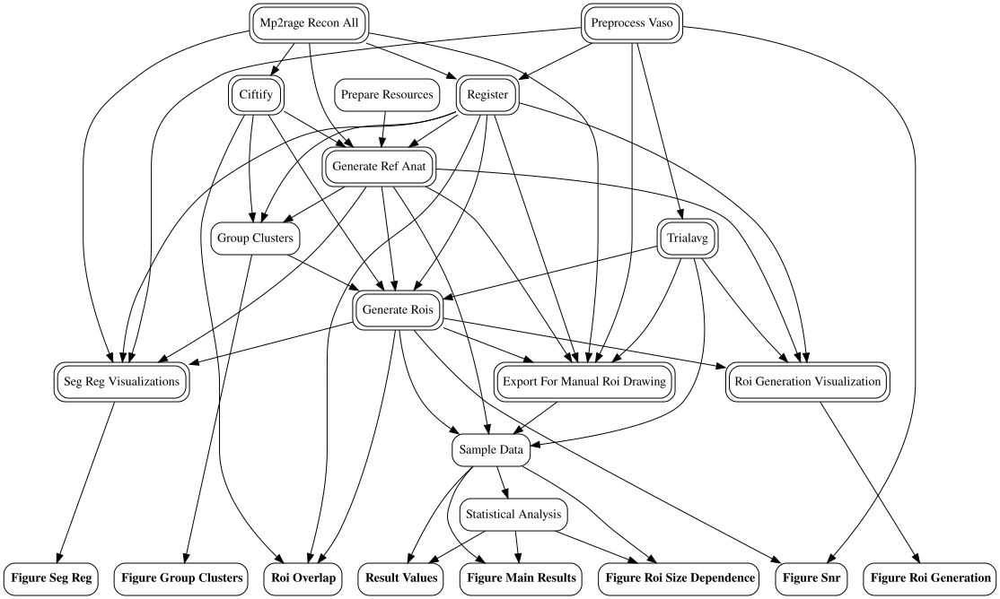

# Code for pfc layer working memory replication study

Filenames containing the code for all processing steps follow this convention:
`nn_(s|g)l_processing-step-description.(py|sh)`
where `nn` is the processing step, `sl` signifies a subject level process and `gl` a group level process.

The scripts use code from included submodules `fmri_analysis` and `vdfs`. They assume a software environment according to the apptainer receipt `gfae.def` and a conda environment according to `environment.yml`.

The entire analysis can be run efficiently, respecting dependencies between steps, by using the top-level script `pipeline.sh`, which uses pipeline running tools from `fmri_analysis`. To run `pipeline.sh` please edit it, setting:

* the location of the BIDS data set
* the location of the apptainer container
* the location of the conda environment
* optionally: parameters for running the pipeline on SLURM, GNU parallel or sequentially

## Visualization the entire processing pipeline
